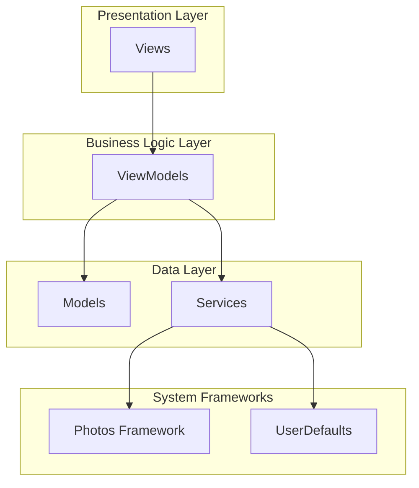

# SharingOnlyProject

**사진을 8방향으로 드래그해서 친구들과 공유하는 혁신적인 iOS 앱**

혁신적인 8방향 드래그 앤 드롭 인터페이스를 통해 직관적인 사진 공유 경험을 제공하는 SwiftUI 기반 iOS 애플리케이션입니다.


## 📱 주요 기능

### 🎯 8방향 드래그 시스템
- **방향**: 상하좌우 + 대각선 4방향 (총 8방향)
- **시각적 피드백**: 원형 드래그 오버레이와 방향 표시기
- **색상 코딩**: 각 방향별 고유한 Spring 테마 컬러
- **햅틱 피드백**: 드래그 성공/실패에 대한 촉각 피드백

### 📸 스마트 사진 관리
- **Photos 프레임워크 통합**: PHPhotoLibrary 완전 지원
- **날짜별 필터링**: 특정 날짜의 사진만 로드
- **즐겨찾기 관리**: 사진 즐겨찾기 토글
- **안전 모드**: 공유 모드에서 사진 삭제/수정 방지
- **고화질 로딩**: 썸네일/풀스크린 상황별 이미지 로딩

### 🎨 듀얼 테마 시스템
- **Spring 테마**: 밝고 자연스러운 컬러의 라이트 인터페이스
- **Sleek 테마**: 미니멀한 다크 인터페이스
- **환경 통합**: SwiftUI 환경 기반 테마 적용
- **설정 저장**: 테마 선택 영구 저장

## 🏗️ 프로젝트 구조

```
SharingOnlyProject/
├── App/
│   └── SharingOnlyApp.swift          # 앱 진입점
│
├── Views/                            # UI 레이어
│   ├── SharingMainView.swift         # 루트 뷰
│   ├── SharingView.swift             # 메인 공유 인터페이스
│   └── Assets.xcassets/              # 앱 아이콘 및 에셋
│
├── ViewModels/                       # 비즈니스 로직
│   ├── PhotoViewModel.swift          # 사진 관리 로직
│   ├── SharingViewModel.swift        # 공유 세션 관리
│   ├── ThemeViewModel.swift          # 테마 관리
│   └── EnhancedAlbumViewModel.swift  # 향상된 앨범 기능
│
├── Models/                           # 데이터 모델
│   ├── Photo/
│   │   ├── PhotoItem.swift           # 핵심 사진 데이터 구조
│   │   └── PhotoConstants.swift      # 사진 관련 상수
│   ├── Sharing/
│   │   └── ShareModels.swift         # 공유 시스템 모델
│   ├── Theme/
│   │   ├── AppTheme.swift            # 테마 열거형
│   │   ├── ThemeColors.swift         # 기본 테마 색상 프로토콜
│   │   ├── SpringThemeColors.swift   # 라이트 테마 구현
│   │   └── SleekThemeColors.swift    # 다크 테마 구현
│   └── Album/
│       └── AlbumModels.swift         # 앨범 관련 데이터 구조
│
├── Services/                         # 데이터 접근 레이어
│   ├── PhotoService.swift            # PHPhotoLibrary 통합
│   ├── SharingService.swift          # 사진 공유 기능
│   └── ThemeService.swift            # 테마 영속성 관리
│
├── Components/                       # 재사용 가능한 UI 컴포넌트
│   ├── DirectionalDragView.swift     # 8방향 드래그 인터페이스
│   ├── RecipientSetupView.swift      # 수신자 관리 UI
│   ├── TemporaryAlbumPreview.swift   # 공유 전 앨범 미리보기
│   ├── FullscreenPhotoViewer.swift   # 풀스크린 사진 뷰어
│   ├── SwipeablePhotoView.swift      # 스와이프 가능한 사진 인터페이스
│   ├── TimelinePhotoHeader.swift     # 사진 타임라인 헤더
│   ├── ThemeSwitcher.swift           # 테마 전환 UI
│   ├── CompactThemeButton.swift      # 컴팩트 테마 토글
│   ├── PhotoOverlayInfo.swift        # 사진 메타데이터 오버레이
│   ├── PhotoInfoHeader.swift         # 사진 정보 헤더
│   ├── PhotoCounter.swift            # 사진 개수 표시
│   └── Pickers/
│       └── DatePickerView.swift      # 커스텀 날짜 선택기
│
└── Utilities/                        # 유틸리티
    ├── Protocols/
    │   └── ViewModelProtocol.swift   # 기본 ViewModel 프로토콜
    ├── Extensions/
    │   └── DateFormatter+Photo.swift # 사진용 날짜 포맷터
    └── Helpers/
        ├── PreviewData.swift         # SwiftUI 미리보기 데이터
        └── DummyImageGenerator.swift # 플레이스홀더 이미지 생성
```

## 🏛️ 아키텍처

### MVVM + Service Layer



### 핵심 아키텍처 패턴

1. **Protocol-Oriented Design**: 테스트 가능성과 의존성 주입을 위한 프로토콜 광범위 사용
2. **Reactive Programming**: 상태 관리를 위한 Combine 프레임워크
3. **Service Layer**: 서비스 프로토콜을 통한 비즈니스 로직 추상화
4. **Theme System**: 환경 값을 통한 포괄적인 테마 시스템

## 🔄 4단계 공유 워크플로우

```
1. 📅 날짜 선택
   ↓
2. 👥 수신자 설정
   ↓
3. 🎯 사진 분배 (8방향 드래그)
   ↓
4. 📤 앨범 미리보기 및 공유
```

### 1. 날짜 선택
- 특정 날짜의 사진 확인
- 그리드 형태의 썸네일 표시
- 풀스크린 사진 뷰어 지원

### 2. 수신자 설정
- 수신자 추가 및 방향 할당
- 8방향 각각에 고유한 색상 자동 지정
- 수신자별 임시 앨범 자동 생성

### 3. 사진 분배
- 혁신적인 8방향 드래그 앤 드롭
- 실시간 시각적 피드백
- 원형 드래그 오버레이 인터페이스

### 4. 앨범 미리보기 및 공유
- 분배된 사진들의 미리보기
- 최종 공유 실행
- 새로 시작하기 옵션

## 🎨 디자인 시스템

### Spring Theme (기본)
- **배경**: 밝은 색상 체계
- **강조색**: 자연스러운 컬러 팔레트
- **텍스트**: 높은 대비도의 어두운 텍스트

### Sleek Theme
- **배경**: 다크 색상 체계
- **강조색**: 미니멀한 컬러 팔레트
- **텍스트**: 높은 대비도의 밝은 텍스트

### 8방향 색상 체계
```swift
상(Top): #E85A5A        // 부드러운 빨강
우상(TopRight): #E87A3E // 따뜻한 주황
우(Right): #D4A65A      // 차분한 황금
우하(BottomRight): #6BB26B // 자연스러운 녹색
하(Bottom): #4A8FB3     // 부드러운 파랑
좌하(BottomLeft): #7A6BB2 // 차분한 보라
좌(Left): #B26BA8       // 부드러운 자주
좌상(TopLeft): #E85A99  // 자연스러운 분홍
```

## 🛠️ 기술 스택

### 핵심 프레임워크
- **SwiftUI**: 주요 UI 프레임워크
- **Photos/PhotosUI**: 사진 라이브러리 접근
- **Combine**: 반응형 프로그래밍 및 상태 관리
- **Foundation**: 핵심 시스템 기능

### iOS 기능
- **PHPhotoLibrary**: 사진 접근 및 관리
- **UIImpactFeedbackGenerator**: 햅틱 피드백
- **UINotificationFeedbackGenerator**: 성공/실패 피드백

### 개발 패턴
- **Action-Based ViewModels**: 깔끔한 액션/상태 패턴
- **Environment Values**: SwiftUI 환경을 통한 테마 전파
- **Async/Await**: 사진 작업을 위한 현대적 동시성
- **Protocol Witnesses**: 테스트를 위한 서비스 레이어 추상화

## 📋 요구사항

- **iOS**: 16.0+
- **Xcode**: 15.0+
- **Swift**: 5.9+
- **권한**: 사진 라이브러리 접근 권한

## 🚀 시작하기

### 1. 클론 및 실행
```bash
git clone https://github.com/yourusername/SharingOnlyProject.git
cd SharingOnlyProject
open SharingOnlyProject.xcodeproj
```

### 2. 빌드 및 실행
1. Xcode에서 프로젝트 열기
2. 시뮬레이터 또는 실제 기기 선택
3. Cmd+R로 빌드 및 실행

### 3. 권한 설정
앱 첫 실행 시 사진 라이브러리 접근 권한을 허용해주세요.

## 🎯 핵심 특징

### 혁신적인 UX/UI
- **8방향 드래그**: 업계 최초의 8방향 사진 분배 시스템
- **직관적 인터페이스**: 학습 곡선 없는 자연스러운 조작
- **실시간 피드백**: 드래그 중 시각적/촉각적 피드백

### 성능 최적화
- **지연 로딩**: 필요시에만 고화질 이미지 로딩
- **메모리 관리**: 효율적인 이미지 캐싱 및 메모리 사용
- **반응형 UI**: 60fps 유지하는 부드러운 애니메이션

### 접근성
- **다이나믹 타입**: 시스템 폰트 크기 지원
- **고대비**: 접근성을 위한 적절한 색상 대비
- **터치 영역**: HIG 가이드라인 준수 (44pt 최소)

## 🔮 향후 계획

- [ ] 실제 공유 기능 구현 (현재는 미리보기만)
- [ ] 애니메이션 및 전환 효과 개선
- [ ] 추가 테마 옵션
- [ ] 다국어 지원 확장
- [ ] iPad 지원
- [ ] 위젯 지원

## 🤝 기여하기

1. Fork the Project
2. Create your Feature Branch (`git checkout -b feature/AmazingFeature`)
3. Commit your Changes (`git commit -m 'Add some AmazingFeature'`)
4. Push to the Branch (`git push origin feature/AmazingFeature`)
5. Open a Pull Request

## 📄 라이선스

이 프로젝트는 MIT 라이선스하에 배포됩니다. 자세한 내용은 `LICENSE` 파일을 참조하세요.

## 👨‍💻 개발자

**Claude** - Initial work

## 🙏 감사의 말

- Apple의 SwiftUI 및 Photos 프레임워크
- iOS 개발 커뮤니티의 지속적인 영감
- 혁신적인 사용자 경험을 추구하는 모든 개발자들

---

**SharingOnlyProject**는 사진 공유의 새로운 패러다임을 제시합니다. 단순한 탭이나 선택이 아닌, 직관적인 방향성을 통해 사진을 친구들에게 전달하는 혁신적인 경험을 만나보세요.