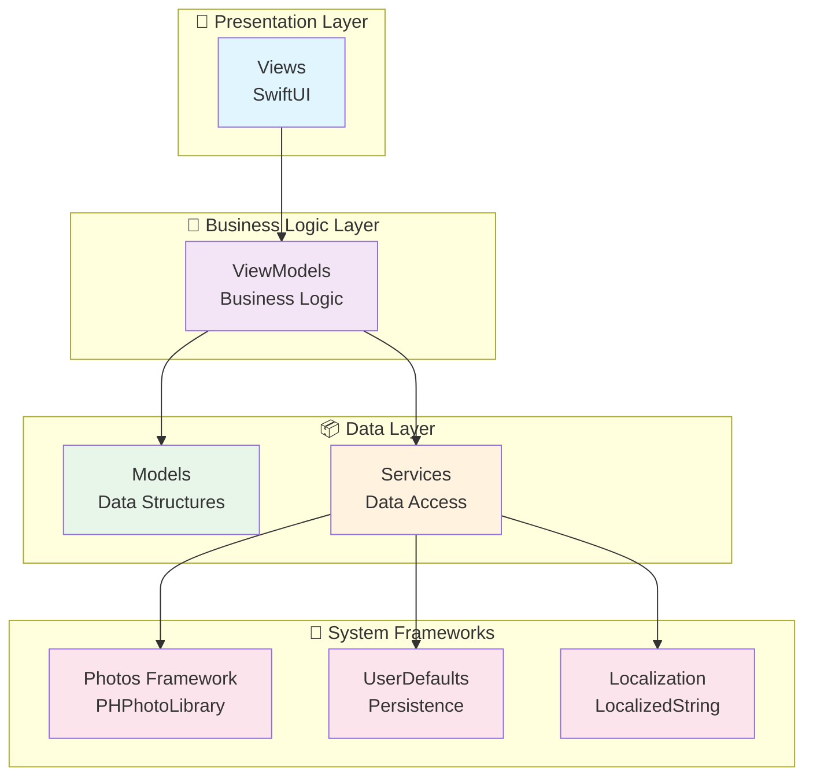

# PHOTO FLICK

<div align="center">

**사진을 8방향으로 드래그해서 친구들과 공유하는 혁신적인 iOS 앱**

혁신적인 8방향 드래그 앤 드롭 인터페이스를 통해 직관적인 사진 공유 경험을 제공하는 SwiftUI 기반 iOS 애플리케이션


</div>

---

## ✨ 차별화된 특징

### 🎯 혁신적인 8방향 드래그 시스템
**업계 최초**의 원형 도넛 오버레이를 활용한 8방향 사진 분배 시스템으로, 직관적이고 재미있는 공유 경험을 제공합니다.

- **360도 방향성**: 상하좌우 + 대각선 4방향 (총 8방향)
- **실시간 시각적 피드백**: 드래그 중 원형 도넛 오버레이로 타겟 방향 즉시 표시
- **색상 코딩**: 각 방향별 고유한 Spring 테마 컬러로 시각적 구분
- **햅틱 피드백**: 드래그 성공/실패/타겟팅에 대한 촉각 피드백
- **중앙 공유 존**: 중앙으로 드래그하여 모든 사람에게 한 번에 공유

### 📸 프로 레벨 사진 관리
**Photos 프레임워크 완전 통합**으로 원활한 사진 접근 및 관리

- **날짜별 스마트 필터링**: 특정 날짜의 사진만 효율적으로 로드
- **듀얼 필터 모드**: 전체 사진 / 사용자 추가 사진만 보기
- **다중 사진 추가**: PhotosPicker를 통한 배치 사진 선택 및 업로드
- **배치 업로드 진행률**: 실시간 업로드 상태 토스트 알림
- **안전 모드**: 공유 모드에서 실수로 인한 사진 삭제/수정 자동 방지
- **적응형 이미지 로딩**:
  - 썸네일: 그리드 표시용 최적화된 저해상도
  - 풀스크린: 고화질 이미지 지연 로딩
  - 사용자 추가 사진: 원본 화질 유지

### 🌍 완전한 다국어 지원
**한국어와 영어** 완벽 지원으로 글로벌 사용자 경험 제공

- **타입 세이프 로컬라이제이션**: `LocalizedString` enum을 통한 컴파일 타임 안전성
- **동적 언어 전환**: 시스템 언어 설정에 따른 자동 전환
- **문화적 적응**: 각 언어별 맞춤 표현 및 UI 문구

### 🎨 듀얼 테마 시스템
**완벽한 라이트/다크 모드** 지원으로 어떤 환경에서도 쾌적한 경험

- **Spring Theme**: 밝고 자연스러운 컬러의 라이트 인터페이스
  - 생동감 있는 Spring 톤 강조색
  - 높은 가독성의 텍스트 대비

- **Sleek Theme**: 미니멀한 다크 인터페이스
  - 눈의 피로를 줄이는 차분한 색상
  - 세련된 다크 모드 경험

- **SwiftUI 환경 통합**: 앱 전체에 일관된 테마 적용
- **영구 저장**: UserDefaults 기반 테마 선택 저장

### 📱 크로스 디바이스 최적화
**iPhone과 iPad 모두**에서 최적화된 경험

- **적응형 레이아웃**:
  - iPhone: 5열 그리드, 3열 수신자 레이아웃
  - iPad: 8열 그리드, 4열 수신자 레이아웃
- **동적 크기 조정**: 기기별 최적화된 사진 및 UI 요소 크기
- **반응형 디자인**: 가로/세로 모드 완벽 지원

---

## 📱 주요 기능

### 🔄 4단계 공유 워크플로우

```
1. 📅 사진 선택 (날짜별)
   ↓
2. 👥 수신자 설정 (최대 8명)
   ↓
3. 🎯 사진 분배 (8방향 드래그)
   ↓
4. 📤 앨범 미리보기 및 공유
```

#### 1. 사진 선택 단계
- **날짜 선택기**: 커스텀 캘린더 UI로 날짜 선택
- **그리드 표시**: 적응형 그리드로 썸네일 표시
- **필터 옵션**: 전체/추가한 사진만 보기
- **다중 추가**: PhotosPicker로 여러 장 동시 추가
- **배치 업로드**: 진행률 표시와 함께 순차적 업로드
- **풀스크린 뷰어**: 탭하여 고화질 전체화면 보기

#### 2. 수신자 설정 단계
- **수신자 추가**: 이름 입력 및 방향 선택 (최대 8명)
- **시각적 방향 선택**: 8방향 아이콘으로 직관적 선택
- **자동 색상 지정**: 방향별 고유 색상 자동 할당
- **임시 앨범 생성**: 각 수신자별 빈 앨범 자동 생성
- **수신자 관리**: 추가/삭제 및 정보 수정

#### 3. 사진 분배 단계
**혁신적인 8방향 드래그 앤 드롭 시스템**

- **원형 도넛 오버레이**:
  - 드래그 시작 시 8개 세그먼트 표시
  - 각 방향별 수신자 정보 및 분배된 사진 개수 표시
  - 활성 세그먼트 확대 및 색상 강조

- **중앙 공유 존**:
  - 중앙으로 드래그하여 모든 사람에게 한 번에 분배
  - 방사형 연결선 애니메이션 표시

- **드래그 인터랙션**:
  - 부드러운 스프링 애니메이션
  - 실시간 방향 감지 및 피드백
  - 드래그 중 축소 효과로 포커스 강화

- **사진 네비게이션**: 하단 이전/다음 버튼으로 사진 전환

#### 4. 앨범 미리보기 및 공유
- **2×2 그리드 앨범 카드**: 각 수신자별 임시 앨범 표시
- **앨범 상세 보기**: 탭하여 개별 앨범 상세 내용 확인
- **사진 그리드**: 3열 그리드로 분배된 사진 표시 (5장 이상 시 +숫자 표시)
- **공유 준비 상태 표시**:
  - 녹색 체크: 모든 앨범 준비 완료
  - 빨간 점: 비어있는 앨범 경고
- **개별/일괄 공유**:
  - 모든 앨범 공유하기 버튼
  - 각 앨범 개별 공유 옵션
- **새로 시작하기**: 분배 초기화 및 재시작

---

## 🏗️ 프로젝트 구조

<details>
<summary><b>📂 디렉토리 구조 보기</b></summary>

```
SharingOnlyProject/
├── App/
│   └── SharingOnlyApp.swift              # 앱 진입점
│
├── Views/                                # UI 레이어
│   ├── SharingMainView.swift             # 루트 뷰 (탭 네비게이션)
│   └── SharingView.swift                 # 메인 공유 워크플로우
│
├── ViewModels/                           # 비즈니스 로직
│   ├── PhotoViewModel.swift              # 사진 관리 (로딩, 필터링, 추가/삭제)
│   ├── SharingViewModel.swift            # 공유 세션 관리 (드래그, 분배, 앨범)
│   ├── ThemeViewModel.swift              # 테마 관리 및 전환
│   └── EnhancedAlbumViewModel.swift      # 향상된 앨범 기능
│
├── Models/                               # 데이터 모델
│   ├── Photo/
│   │   ├── PhotoItem.swift               # 사진 데이터 구조 (PHAsset + 사용자 추가)
│   │   └── PhotoConstants.swift          # 사진 관련 상수
│   ├── Sharing/
│   │   └── ShareModels.swift             # 공유 시스템 모델
│   │       ├── ShareDirection            # 8방향 열거형
│   │       ├── ShareRecipient            # 수신자 정보
│   │       ├── TemporaryAlbum            # 임시 앨범
│   │       ├── ShareSession              # 공유 세션
│   │       └── DragState                 # 드래그 상태
│   ├── Theme/
│   │   ├── AppTheme.swift                # 테마 열거형
│   │   ├── ThemeColors.swift             # 기본 테마 프로토콜
│   │   ├── SpringThemeColors.swift       # 라이트 테마 구현
│   │   └── SleekThemeColors.swift        # 다크 테마 구현
│   └── Album/
│       └── AlbumModels.swift             # 앨범 데이터 구조
│
├── Services/                             # 데이터 접근 레이어
│   ├── PhotoService.swift                # PHPhotoLibrary 통합
│   ├── SharingService.swift              # 사진 공유 로직
│   └── ThemeService.swift                # 테마 영속성 (UserDefaults)
│
├── Components/                           # 재사용 가능한 UI 컴포넌트
│   ├── DirectionalDragView.swift         # 8방향 드래그 인터페이스
│   │   ├── EnhancedPhotoDragView         # 드래그 가능한 사진 뷰
│   │   ├── DonutSegmentShape             # 도넛 세그먼트 Shape
│   │   └── EmptyPhotoView                # 빈 상태 표시
│   ├── RecipientSetupView.swift          # 수신자 관리 UI
│   │   ├── RecipientCard                 # 수신자 카드
│   │   └── AddRecipientSheet             # 수신자 추가 시트
│   ├── TemporaryAlbumPreview.swift       # 공유 전 앨범 미리보기
│   │   ├── AlbumPreviewCard              # 앨범 카드 (2x2 그리드)
│   │   └── AlbumDetailSheet              # 앨범 상세 뷰
│   ├── FullscreenPhotoViewer.swift       # 풀스크린 사진 뷰어
│   ├── SwipeablePhotoView.swift          # 스와이프 사진 뷰
│   ├── TimelinePhotoHeader.swift         # 타임라인 헤더
│   ├── ThemeSwitcher.swift               # 테마 전환 UI
│   ├── CompactThemeButton.swift          # 컴팩트 테마 토글
│   ├── PhotoOverlayInfo.swift            # 사진 메타데이터
│   ├── PhotoInfoHeader.swift             # 사진 정보 헤더
│   ├── PhotoCounter.swift                # 사진 개수 표시
│   ├── PhotoPickerView.swift             # 사진 선택기
│   └── Pickers/
│       └── DatePickerView.swift          # 커스텀 날짜 선택기
│
├── Utilities/                            # 유틸리티
│   ├── LocalizedString.swift             # 타입 세이프 다국어 지원
│   ├── Protocols/
│   │   └── ViewModelProtocol.swift       # 기본 ViewModel 프로토콜
│   ├── Extensions/
│   │   └── DateFormatter+Photo.swift     # 사진용 날짜 포맷터
│   └── Helpers/
│       ├── PreviewData.swift             # SwiftUI 미리보기 데이터
│       └── DummyImageGenerator.swift     # 플레이스홀더 이미지
│
└── Resources/                            # 리소스
    ├── ko.lproj/
    │   └── Localizable.strings           # 한국어 번역
    └── en.lproj/
        └── Localizable.strings           # 영어 번역
```

</details>

---

## 🏛️ 아키텍처

### MVVM + Service Layer



### 핵심 아키텍처 패턴

1. **Protocol-Oriented Design**
   - 테스트 가능성과 의존성 주입을 위한 프로토콜 광범위 사용
   - `ViewModelProtocol`, `ThemeColors` 등 추상화 계층

2. **Reactive Programming**
   - `@ObservedObject`, `@StateObject`를 통한 상태 관리
   - Combine 프레임워크 기반 반응형 데이터 플로우

3. **Service Layer Abstraction**
   - 서비스 프로토콜을 통한 비즈니스 로직 캡슐화
   - Photos, Sharing, Theme 서비스 분리

4. **Environment-Based Theme System**
   - SwiftUI 환경 값을 통한 글로벌 테마 전파
   - `@Environment(\.theme)` 패턴

5. **Type-Safe Localization**
   - Enum 기반 타입 세이프 다국어 시스템
   - 컴파일 타임 문자열 검증

---

## 🎨 디자인 시스템

### 테마 시스템

#### Spring Theme (기본 라이트)
```swift
primaryBackground: #FFFFFF      // 순백 배경
secondaryBackground: #F5F5F5    // 연한 회색
accentColor: #4A8FB3           // 부드러운 파랑
primaryText: #000000           // 검은 텍스트
secondaryText: #666666         // 회색 텍스트
```

#### Sleek Theme (다크)
```swift
primaryBackground: #1C1C1E      // 다크 배경
secondaryBackground: #2C2C2E    // 약간 밝은 다크
accentColor: #0A84FF           // 선명한 파랑
primaryText: #FFFFFF           // 흰색 텍스트
secondaryText: #AEAEB2         // 연한 회색 텍스트
```

### 8방향 색상 체계 (Spring Tone)

| 방향 | 색상 코드 | 설명 |
|------|----------|------|
| 상(Top) | `#E85A5A` | 부드러운 빨강 |
| 우상(TopRight) | `#E87A3E` | 따뜻한 주황 |
| 우(Right) | `#D4A65A` | 차분한 황금 |
| 우하(BottomRight) | `#6BB26B` | 자연스러운 녹색 |
| 하(Bottom) | `#4A8FB3` | 부드러운 파랑 |
| 좌하(BottomLeft) | `#7A6BB2` | 차분한 보라 |
| 좌(Left) | `#B26BA8` | 부드러운 자주 |
| 좌상(TopLeft) | `#E85A99` | 자연스러운 분홍 |

### UI 원칙

- **간결성**: 불필요한 요소 제거, 핵심 기능에 집중
- **일관성**: 전체 앱에 걸쳐 통일된 디자인 언어
- **피드백**: 모든 인터랙션에 명확한 시각/촉각 피드백
- **접근성**: WCAG 2.1 AA 준수, 다이나믹 타입 지원

---

## 🛠️ 기술 스택

### 핵심 프레임워크
- **SwiftUI** (iOS 16.0+): 선언형 UI 프레임워크
- **Photos/PhotosUI**: 사진 라이브러리 접근 및 선택
- **Combine**: 반응형 프로그래밍 및 상태 관리
- **Foundation**: 핵심 시스템 기능

### iOS 기능
- **PHPhotoLibrary**: 사진 접근, 수정, 관리
- **PhotosPicker**: 네이티브 사진 선택 인터페이스
- **UIImpactFeedbackGenerator**: 햅틱 피드백
- **UINotificationFeedbackGenerator**: 성공/실패 햅틱
- **UserDefaults**: 설정 영속성

### 개발 패턴
- **Action-Based ViewModels**: 깔끔한 액션/상태 패턴으로 단방향 데이터 플로우
- **Environment Values**: SwiftUI 환경을 통한 의존성 주입
- **Async/Await**: 사진 작업을 위한 현대적 동시성
- **Protocol Witnesses**: 테스트 가능한 서비스 레이어
- **Compositional Layout**: 적응형 그리드 레이아웃

### 코드 품질
- **Type Safety**: Swift의 강력한 타입 시스템 활용
- **Memory Management**: ARC 기반 자동 메모리 관리
- **Error Handling**: Swift Error 프로토콜 기반 에러 처리
- **Localization**: 타입 세이프 다국어 지원

---

## 📋 요구사항

- **iOS**: 16.0 이상
- **Xcode**: 15.0 이상
- **Swift**: 5.9 이상
- **기기**: iPhone, iPad
- **권한**: 사진 라이브러리 접근 권한 필수

---

## 🚀 시작하기

### 1. 프로젝트 클론
```bash
git clone https://github.com/yourusername/SharingOnlyProject.git
cd SharingOnlyProject
```

### 2. Xcode에서 열기
```bash
open SharingOnlyProject.xcodeproj
```

### 3. 빌드 및 실행
1. Xcode에서 타겟 기기 선택 (시뮬레이터 또는 실제 기기)
2. `Cmd + R` 또는 Run 버튼 클릭
3. 첫 실행 시 사진 라이브러리 접근 권한 허용

### 4. 개발 환경 설정
```bash
# 의존성 없음 - 순수 Swift/SwiftUI 프로젝트
# 추가 설정 불필요
```

---

## 🎯 핵심 차별점

### 1. 혁신적인 인터랙션 디자인
- **8방향 드래그**: 업계 최초의 360도 방향성 사진 분배
- **도넛 오버레이**: 직관적인 원형 인터페이스로 학습 곡선 최소화
- **중앙 공유 존**: 한 번의 드래그로 모든 사람에게 분배

### 2. 완벽한 사용자 경험
- **실시간 피드백**: 드래그 중 시각적/촉각적 피드백
- **배치 업로드**: 진행률 표시와 함께 여러 사진 동시 추가
- **안전 모드**: 공유 중 실수 방지 시스템
- **다국어 지원**: 한국어/영어 완벽 지원

### 3. 성능 최적화
- **지연 로딩**: 필요시에만 고화질 이미지 로딩
- **메모리 효율**: 적응형 이미지 크기 및 캐싱
- **부드러운 애니메이션**: 60fps 유지

### 4. 접근성
- **다이나믹 타입**: 시스템 폰트 크기 지원
- **고대비 모드**: 접근성을 위한 색상 대비
- **터치 영역**: HIG 가이드라인 준수 (최소 44pt)
- **VoiceOver**: 화면 낭독 지원 (추후 개선 예정)

---

## 🔮 로드맵

### Phase 1: 현재 (v1.0) ✅
- [x] 8방향 드래그 시스템 구현
- [x] 사진 관리 및 필터링
- [x] 듀얼 테마 시스템
- [x] 다국어 지원 (한국어/영어)
- [x] 배치 사진 업로드
- [x] 임시 앨범 미리보기

### Phase 2: 단기 목표 (v1.1-1.5)
- [ ] 실제 공유 기능 구현 (ShareSheet, Messages 통합)
- [ ] 애니메이션 및 전환 효과 개선
- [ ] VoiceOver 완벽 지원
- [ ] 추가 테마 옵션 (3-5개)
- [ ] iCloud 사진 라이브러리 지원

### Phase 3: 중기 목표 (v2.0)
- [ ] 다국어 확장 (일본어, 중국어, 스페인어)
- [ ] iPad 전용 UI 최적화
- [ ] 위젯 지원 (최근 공유 앨범)
- [ ] Shortcuts 앱 통합
- [ ] Apple Watch 컴패니언 앱

### Phase 4: 장기 목표 (v3.0)
- [ ] AI 기반 사진 자동 분류
- [ ] 공유 히스토리 및 통계
- [ ] 클라우드 동기화
- [ ] 소셜 미디어 통합

---

## 🧪 테스트

### 단위 테스트
```bash
# Xcode에서 실행
Cmd + U
```

### UI 테스트
```bash
# UI 테스트 실행
Cmd + U (UI Test Target 선택)
```

### 수동 테스트 체크리스트
- [ ] 8방향 드래그가 모든 방향에서 작동
- [ ] 사진 추가/삭제가 정상 작동
- [ ] 테마 전환이 즉시 반영
- [ ] 다국어 전환이 올바르게 표시
- [ ] 배치 업로드 진행률 표시 정확

---

## 🤝 기여하기

기여는 언제나 환영입니다! 다음 단계를 따라주세요:

1. Fork the Project
2. Create your Feature Branch
   ```bash
   git checkout -b feature/AmazingFeature
   ```
3. Commit your Changes
   ```bash
   git commit -m 'Add some AmazingFeature'
   ```
4. Push to the Branch
   ```bash
   git push origin feature/AmazingFeature
   ```
5. Open a Pull Request

### 코딩 컨벤션
- Swift 스타일 가이드 준수
- SwiftUI 모범 사례 따르기
- 주석은 한국어 또는 영어로 명확하게 작성
- 모든 새 기능은 테스트 포함

---

## 📄 라이선스

이 프로젝트는 MIT 라이선스하에 배포됩니다. 자세한 내용은 [LICENSE](LICENSE) 파일을 참조하세요.

---

## 👨‍💻 개발자

**Claude** - AI Assistant
- Initial Development
- Architecture Design
- Feature Implementation

---

## 🙏 감사의 말

- **Apple**: SwiftUI, Photos Framework 제공
- **iOS 개발 커뮤니티**: 지속적인 영감과 지원
- **오픈소스 커뮤니티**: 혁신적인 아이디어와 패턴

---

## 📞 문의 및 지원

- **이슈**: [GitHub Issues](https://github.com/yourusername/SharingOnlyProject/issues)
- **문의**: your.email@example.com
- **문서**: [Wiki](https://github.com/yourusername/SharingOnlyProject/wiki)

---

<div align="center">

**PHOTO FLICK**는 사진 공유의 새로운 패러다임을 제시합니다.

단순한 탭이나 선택이 아닌, **직관적인 방향성**을 통해 사진을 친구들에게 전달하는 혁신적인 경험을 만나보세요.

---

Made with ❤️ using SwiftUI

</div>
